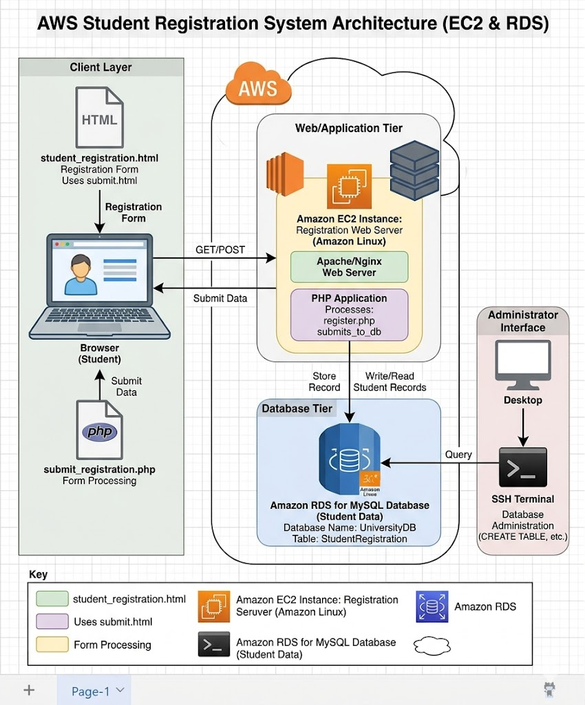

Student Registration System

A web-based Student Registration System developed using the LEMP stack and deployed on an AWS EC2 Ubuntu server.

📌 Project Overview

The Student Registration System is designed to collect and store student registration details through a web-based interface.

The project uses HTML and CSS for the frontend, PHP for backend processing, and MariaDB for database management. The application is hosted on an Ubuntu AWS EC2 instance using Nginx.

🎯 Objectives

Create a simple and user-friendly student registration form.

Collect student registration information.

Store student details in a database.

Deploy the application on an AWS EC2 Ubuntu server.

Configure Nginx as the web server.

Use PHP for server-side processing.

Use MariaDB for database management.

Manage the project using Git and GitHub.

🛠️ Technologies Used

Technology

Purpose

Ubuntu Linux

Server operating system

AWS EC2

Cloud hosting

Nginx

Web server

PHP

Backend processing

MariaDB

Database

HTML

Frontend structure

CSS

Web page styling

Git

Version control

GitHub

Source code hosting

🏗️ System Architecture

User
  │
  ▼
Web Browser
  │
  ▼
Nginx Web Server
  │
  ▼
HTML / CSS / PHP
  │
  ▼
MariaDB Database

📁 Project Structure

student-registration-system/
│
├── index.html
├── style.css
├── submit.php
├── database.sql
├── .gitignore
├── README.md
│
└── screenshots/
    ├── 01-aws-ec2-instance.png
    ├── 02-ssh-connection.png
    ├── 03-ubuntu-terminal.png
    ├── 04-apt-update.png
    ├── 05-nginx-installation.png
    ├── 06-php-installation.png
    ├── 07-mariadb-installation.png
    ├── 08-nginx-status.png
    ├── 09-mariadb-status.png
    ├── 10-php-status.png
    ├── 11-var-www-html.png
    ├── 12-index-html.png
    ├── 13-nginx-browser-test.png
    ├── 14-database.png
    └── 15-project-working.png

☁️ AWS EC2 Deployment

The application was deployed on an Ubuntu EC2 instance.

Update Ubuntu

sudo apt update

Install Nginx

sudo apt install nginx -y

Install PHP-FPM

sudo apt install php8.5-fpm -y

Install MariaDB

sudo apt install mariadb-server -y

Check Services

sudo systemctl status nginx
sudo systemctl status mariadb
sudo systemctl status php8.5-fpm

Project Directory

The application files are stored in:

/var/www/html

🗄️ Database

MariaDB is used to store student registration information.

Example database:

CREATE DATABASE student_registration;

Example table:

CREATE TABLE students (
    id INT AUTO_INCREMENT PRIMARY KEY,
    name VARCHAR(100) NOT NULL,
    email VARCHAR(100) NOT NULL,
    phone VARCHAR(20) NOT NULL,
    course VARCHAR(100) NOT NULL,
    address TEXT NOT NULL,
    created_at TIMESTAMP DEFAULT CURRENT_TIMESTAMP
);

✨ Features

Student registration form

Student name field

Email field

Phone number field

Course selection

Address field

PHP form processing

MariaDB database storage

Nginx web server

AWS EC2 deployment

Git and GitHub integration

📸 Project Screenshots

AWS EC2 Instance

SSH Connection

Ubuntu Terminal

APT Update

Nginx Installation

PHP Installation

MariaDB Installation

Nginx Status

MariaDB Status

PHP Status

Web Directory

index.html

Browser Test

Database

Project Working

🚀 GitHub Setup

git init
git add .
git commit -m "Initial commit - Student Registration System"
git branch -M main
git remote add origin https://github.com/ankurkhurpadi/student-registration-system.git
git push -u origin main

🧪 Testing

The application can be tested by:

Opening the EC2 public IP in a web browser.

Opening the Student Registration form.

Entering valid student details.

Submitting the form.

Checking whether the information is stored in MariaDB.

📌 Conclusion

The Student Registration System demonstrates how a PHP-based web application can be deployed on an AWS EC2 Ubuntu server using the LEMP stack.

The project combines frontend development, PHP backend processing, MariaDB database management, Nginx configuration, Linux server administration, AWS cloud deployment, and GitHub version control.

👨‍💻 Author

Ankur Khurpadi

Student Registration System
Developed using LEMP Stack and AWS EC2.

⭐ GitHub Repository

https://github.com/ankurkhurpadi/student-registration-system
